#### References

[ESP32 Datasheet](https://cdn.sparkfun.com/assets/learn_tutorials/8/5/2/ESP32ThingPlus_GraphicalDatasheet.pdf)

#### Switch Harness

1. Separate (pull apart) a black/white pair from the jumper wires.
   Cut this pair in the middle and strip 1cm of the ends on one of the
   halves.

2. Separate a brown wire from the jumper wires. Cut this wire in the
   middle and strip 1cm of the ends on both halves.
   
3. Twist the stripped black lead together with the stripped brown
   leads and solder to post "1b" on the switch (under the "1" part of
   the switch).

4. Solder the white lead to the center post of the switch.

#### Display Header

The display comes with an appropriately sized right-angle header.

1. Solder the right-angle header onto the display.  The pins should
   face inward, towards the circuitry under the display.
   

#### ESP32 Headers

1. Break the right-angle header stock into a 12 pin piece and a 16 pin
   piece.
   
2. Solder the headers onto the top of the ESP32 module with the pins
   facing away from the board.
   
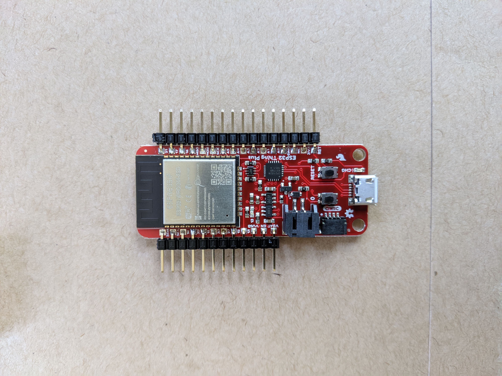
   

#### Display Harness

1. Separate eight wires from the jumper wires.  It's best if you can
   match the colors in the picture.
   
2. Attach the wires to the display module as shown.

3. Attach the other ends of the wires to the ESP32 module as shown in
   the picture.
   

   

#### Led Wires

1. Separate a blue and green pair from the jumper wires.  Split the
   pair most of the way to one side.
   
2.  Attach the non-split side of the pair to the ESP32 module as
    shown.

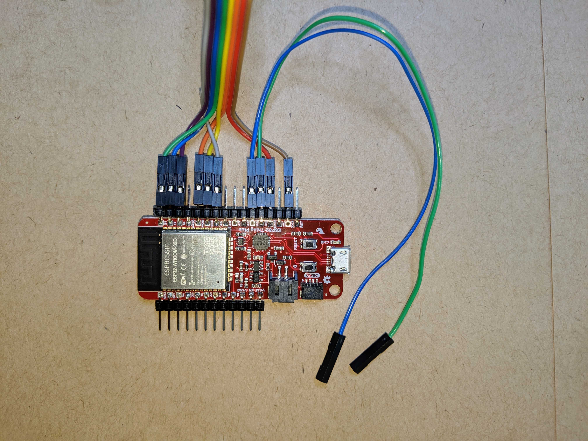
    
    
#### Keypad

1. Insert the keypad connector through the slot at the bottom of the
   case front.
   
2. Peel the adhesive cover off the back of the keypad and press it
   into place on the case as shown.
   

#### Attach Display to Case

1. Gently screw the display in place in the case.  DO NOT OVERTIGHTEN
   SCREWS.
   
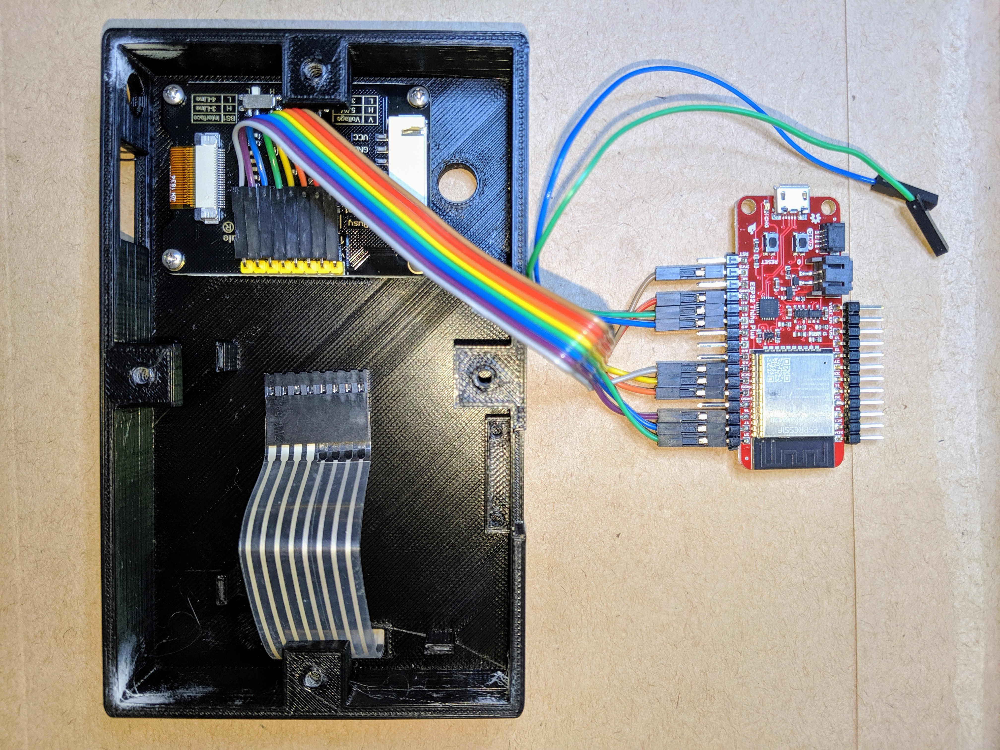
   

#### Attach LEDs to Case

1. Insert the blue led into a led holder and snap into place in the
   hole in the side of the case (above where the power switch will go.
   It's helpful if the led's leads are horizontally oriented.
   
2. Insert the green led into a led holder and snap into place in the
   hole in the front of the case.  Again it's helpful if the leads are
   oriented horizontally.
   
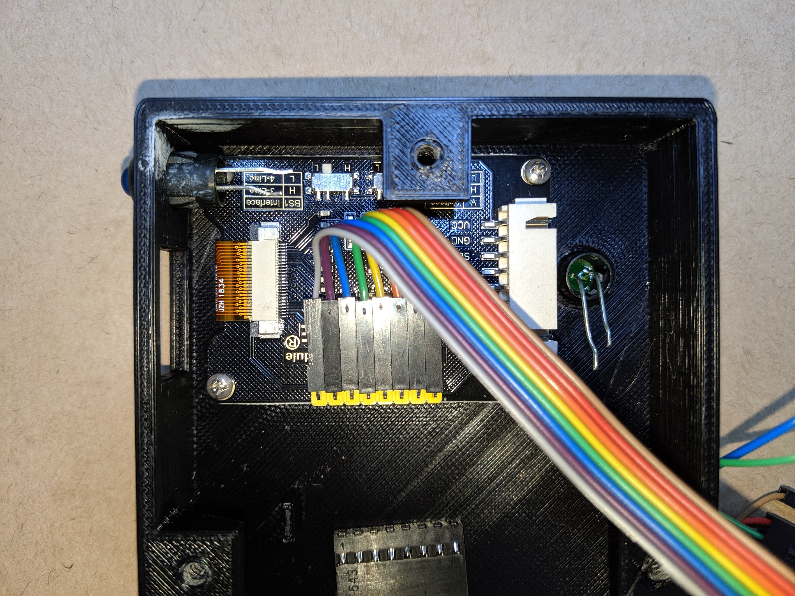

#### Attach the Switch to Case

1. Snap the switch into place in the case.  Orient the switch so the
   "1" side is towards the top of the case.
   
2. Connect the white and black switch leads to the ESP32 module as
   shown.
   
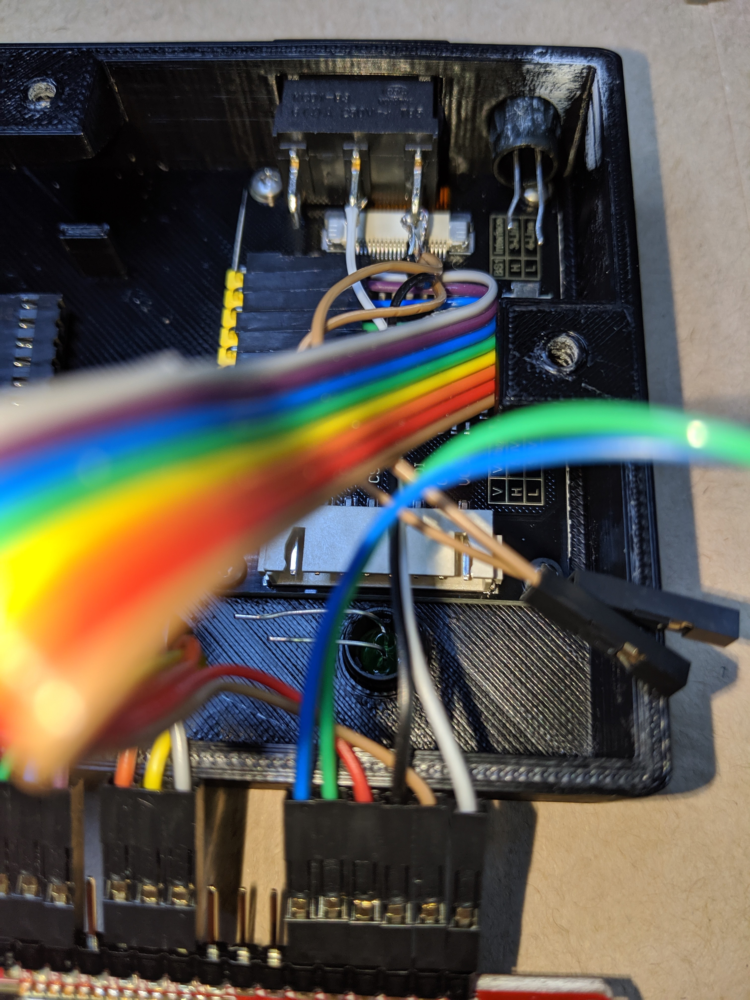

#### Insert Battery

1. Place the battery into the guides as shown.

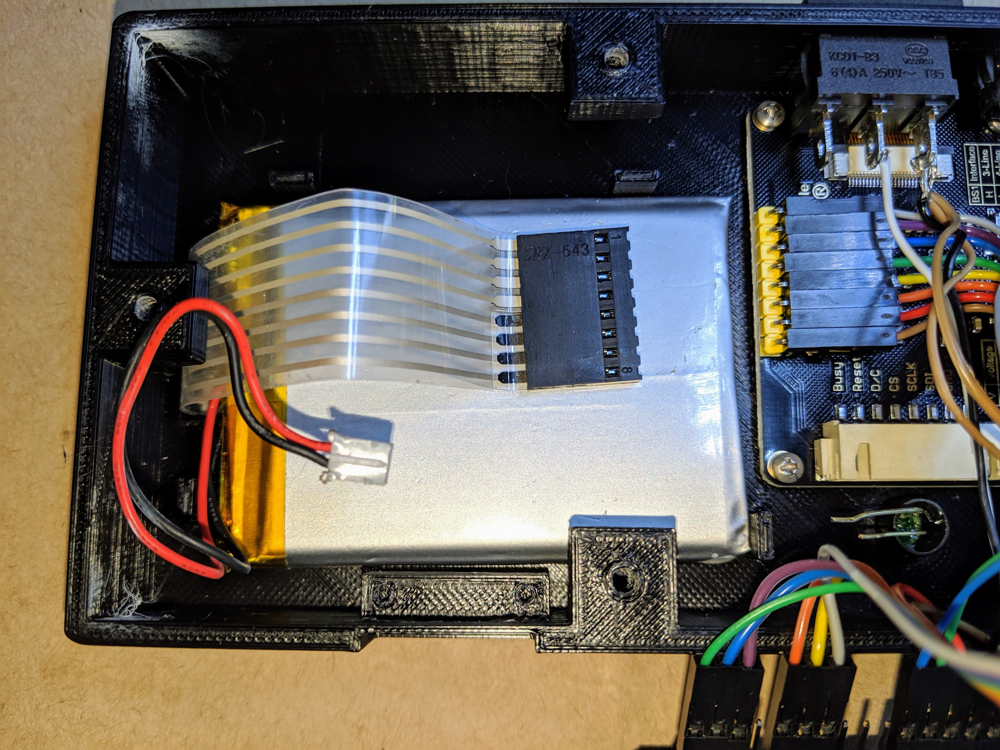

#### Battery Shield

1. Place the shield on top of the battery in the guides as shown.

The shield prevents the ESP32 module from damaging the surface of the
battery.

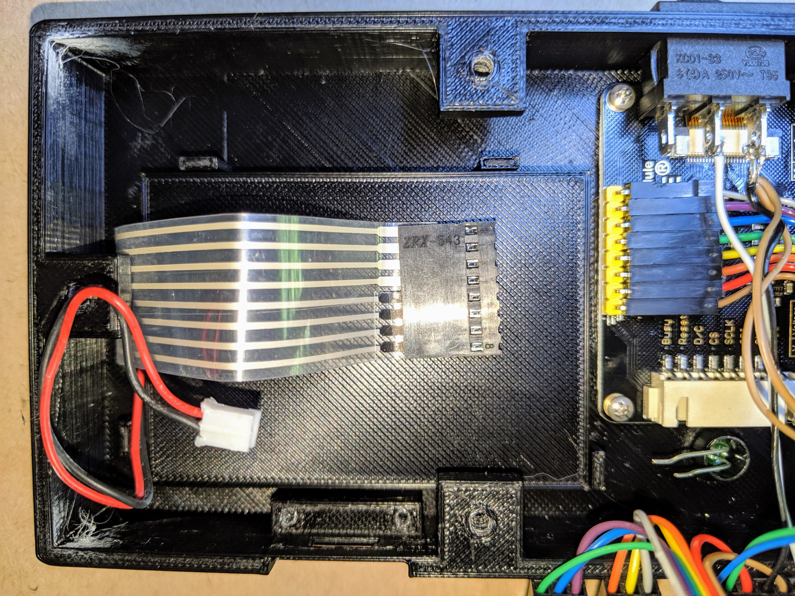

#### Keypad Connector

1. Connect the keypad connector to the ESP32 as shown. Note that the
   connector fits "one pin in" from the end of the header.

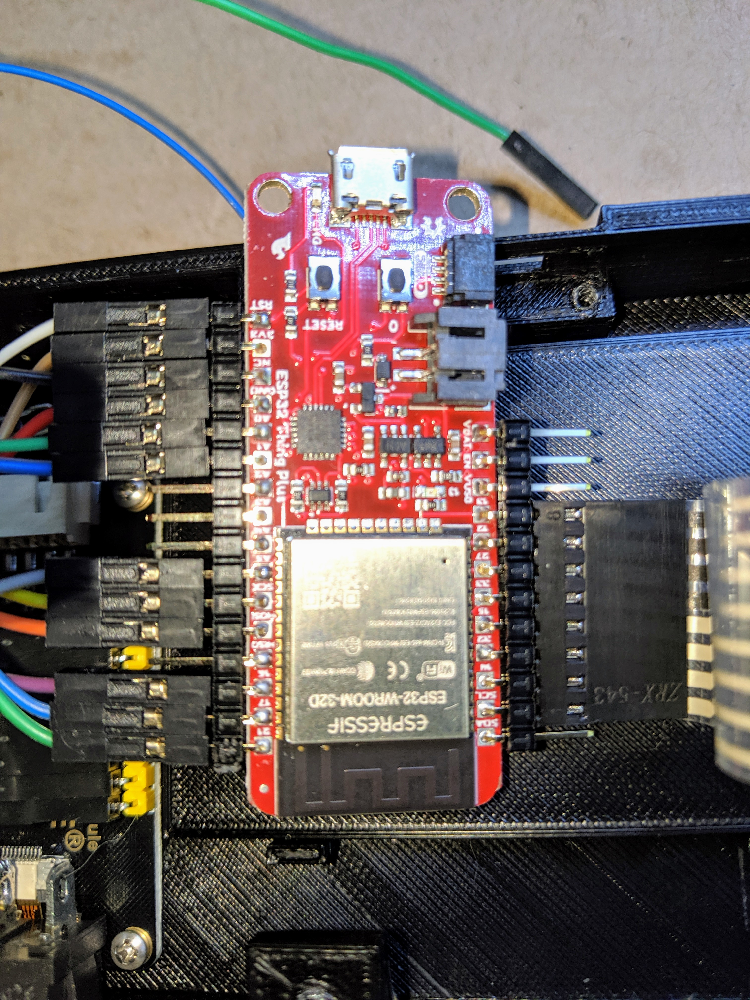

#### Attach ESP32 to Case

1. Fit the ESP32 into is mounting location.  Attach with screws.  DO
   NOT OVERTIGHTEN THE SCREWS.

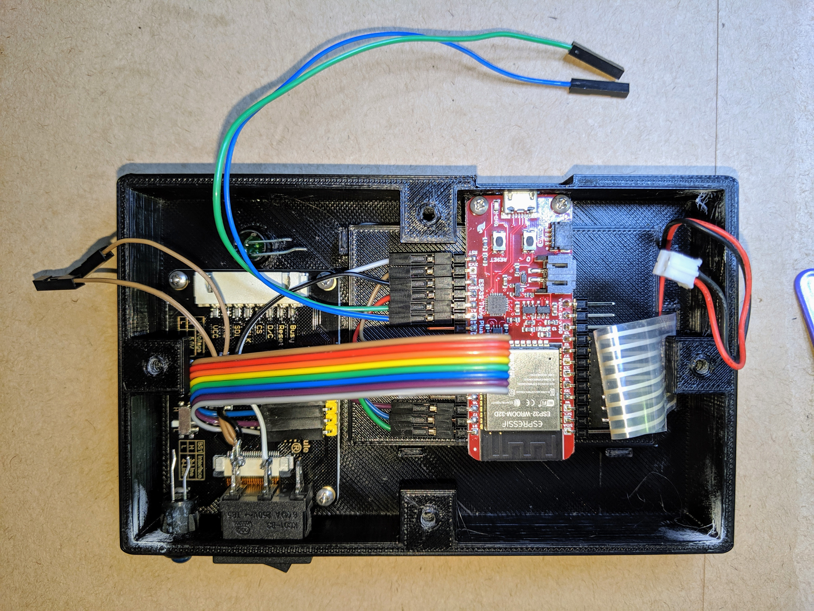

#### Connect LEDS

1. Connect the green wire to the longer lead of the green led.

2. Connect the blue wire to the longer lead of the blue led.

3. Connect one of the brown wires to the shorter lead of the green led.

4. Connect the other brown wires to the shorter lead of the blue led.

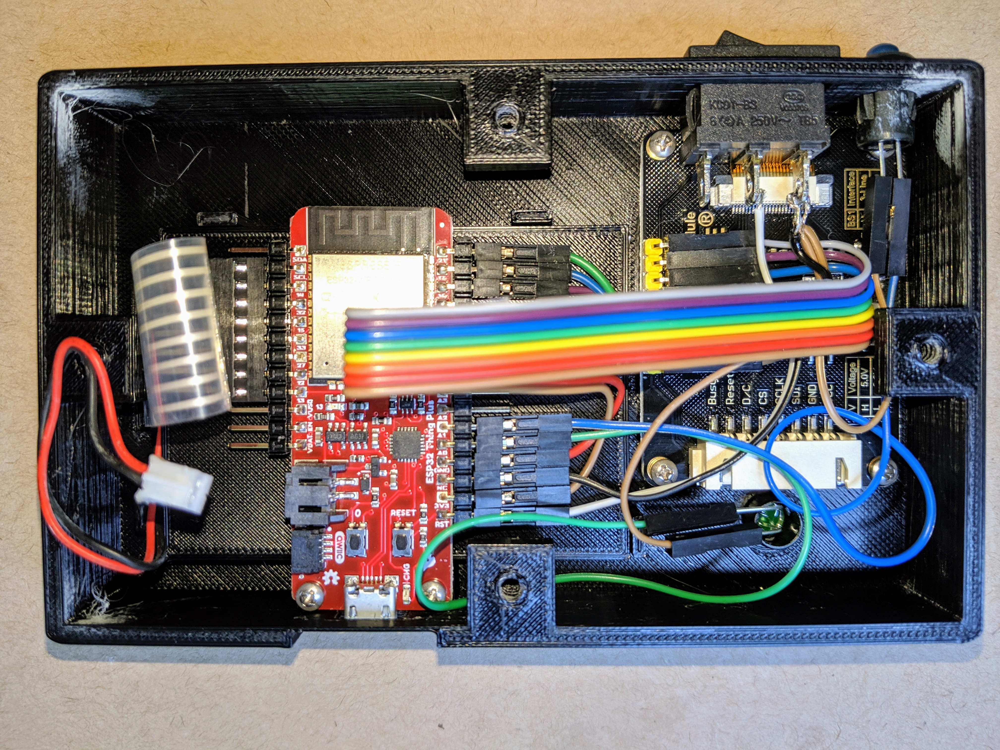

#### Connect Battery

1. Carefully connect the battery to the ESP32.  Support the ESP32 as
   you insert the connector to avoid stressing the attachment screws.
   
**IMPORTANT** - Always disconnect the battery first when working on
the inside of the terminal to avoid damaging the cicuits.

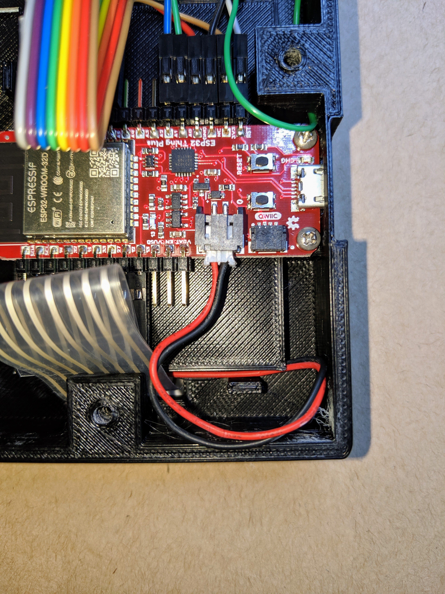

#### That's It!

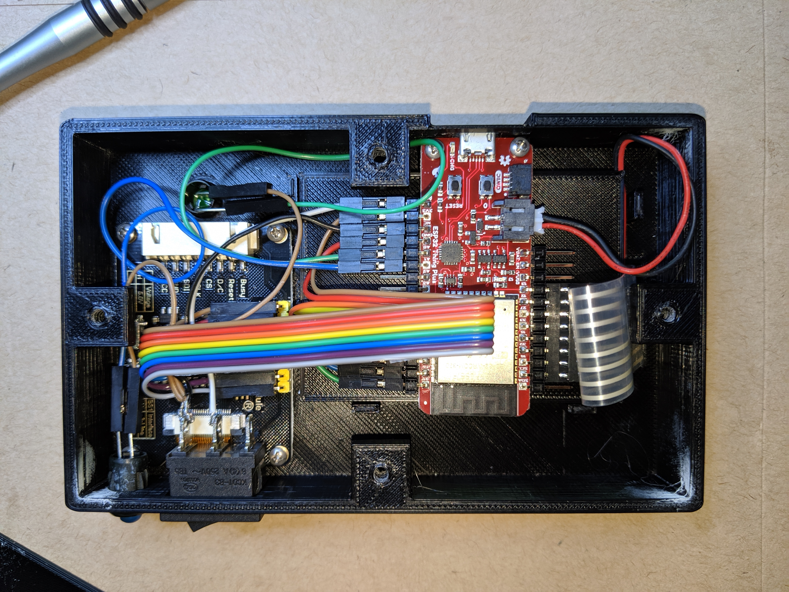

#### Attach the Cover

1. Attach the cover to the back with the screws.

