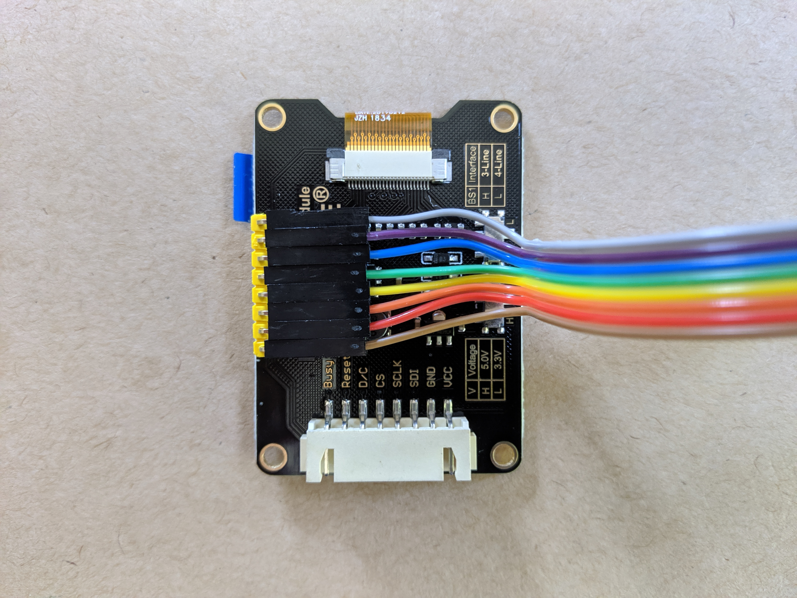
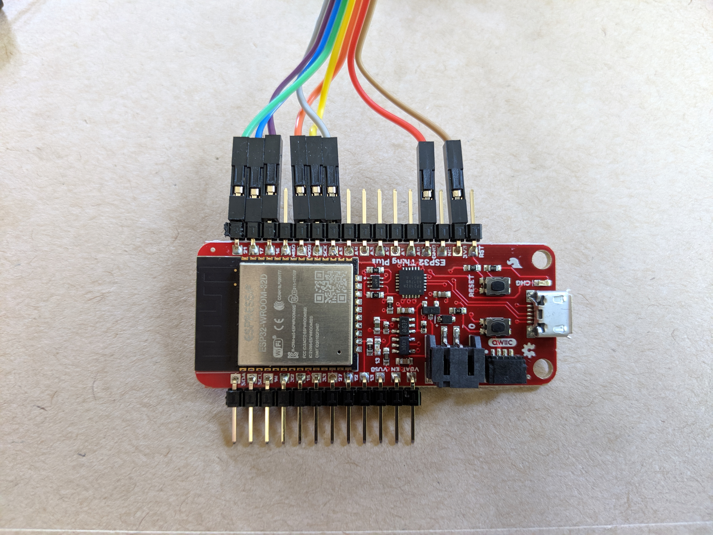

#### References

[ESP32 Datasheet](https://cdn.sparkfun.com/assets/learn_tutorials/8/5/2/ESP32ThingPlus_GraphicalDatasheet.pdf)

#### Switch Harness

1. Separate (pull apart) a black/white pair from the jumper wires.
   Cut this pair in the middle and strip 1cm of the ends on one of the
   halves.

2. Separate a brown wire from the jumper wires. Cut this wire in the
   middle and strip 1cm of the ends on both halves.
   
3. Twist the stripped black lead together with the stripped brown
   leads and solder to post "1b" on the switch (under the "1" part of
   the switch).

4. Solder the white lead to the center post of the switch.

#### Display Header

The display comes with an appropriately sized right-angle header.

1. Solder the right-angle header onto the display.  The pins should
   face inward, towards the circuitry under the display.
   

#### ESP32 Headers

1. Break the right-angle header stock into a 12 pin piece and a 16 pin
   piece.
   
2. Solder the headers onto the top of the ESP32 module with the pins
   facing away from the board.
   

   

#### Display Harness

1. Separate eight wires from the jumper wires.  It's best if you can
   match the colors in the picture.
   
2. Attach the wires to the display module as shown.

3. Attach the other ends of the wires to the ESP32 module as shown in
   the picture.
   

   

#### Led Wires

1. Separate a blue and green pair from the jumper wires.  Split the
   pair most of the way to one side.
   
2.  Attach the non-split side of the pair to the ESP32 module as
    shown.

    
    
